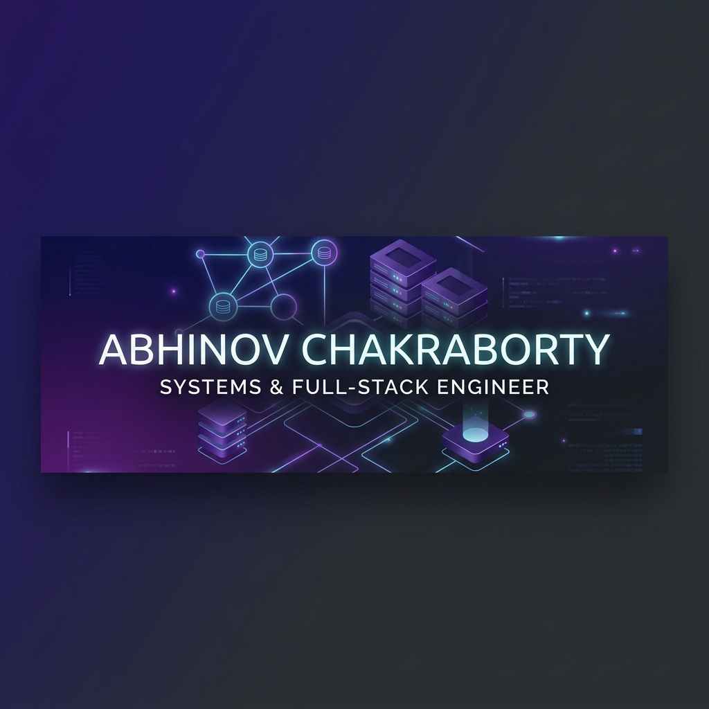

  

<h1 align="center">Hi, I'm Abhinov Chakraborty 👋</h1>

  <strong>Software Engineer building systems from scratch — databases, networking protocols, realtime apps, and private AI products.</strong>

  
  &nbsp;&nbsp;
  
  &nbsp;&nbsp;
  

---

### 🚀 What I Build

I focus on engineering-heavy projects that dive deep into system-level design and protocol implementation, moving beyond typical CRUD architectures:

*   **In-Memory Databases** & custom serialization protocols
*   **P2P Networking** & distributed peer discovery protocols
*   **Realtime Collaboration** engines using persistent state synchronization
*   **Privacy-First AI** applications leveraging local/on-device inference

---

### 🧠 Featured Projects

<table width="100%" cellpadding="10" cellspacing="0" border="0">
  <tr>
    <!-- Project 1 -->
    <td width="50%" valign="top" style="border: 1px solid #30363d; border-radius: 6px; padding: 16px;">
      <h3>🔴 Redis Clone</h3>
      
<em>A Redis-compatible server built from scratch in Node.js.</em>

      <ul>
        <li>Implemented custom <strong>RESP protocol parser</strong></li>
        <li>Supported Strings, Lists, Hashes, and Key Expiry</li>
        <li><strong>AOF + RDB persistence</strong> for data durability</li>
        <li>Master/replica replication engine & Pub/Sub messaging</li>
      </ul>
      

        
        
        
        
      

    </td>
    <!-- Project 2 -->
    <td width="50%" valign="top" style="border: 1px solid #30363d; border-radius: 6px; padding: 16px;">
      <h3>🤖 AI RAG Messenger</h3>
      
<em>A privacy-first AI messenger with local/offline AI support.</em>

      <ul>
        <li>React Native app with <strong>local SQLite storage</strong></li>
        <li>Supabase sync, Clerk authentication, and realtime updates</li>
        <li><strong>Local Llama model</strong> support for offline RAG Q&A</li>
        <li>Offline mesh messaging using <strong>BLE / Wi-Fi Direct</strong></li>
      </ul>
      

        
        
        
        
      

    </td>
  </tr>
  <tr>
    <!-- Project 3 -->
    <td width="50%" valign="top" style="border: 1px solid #30363d; border-radius: 6px; padding: 16px;">
      <h3>🎨 ColabDraw</h3>
      
<em>Realtime collaborative drawing app inspired by Excalidraw.</em>

      <ul>
        <li>Realtime WebSocket-based drawing engine</li>
        <li>Shared collaborative rooms with JWT authorization</li>
        <li>Role-based access: Owner, Editor, and Viewer</li>
        <li>PostgreSQL persistence via Prisma ORM</li>
      </ul>
      

        
        
        
        
      

    </td>
    <!-- Project 4 -->
    <td width="50%" valign="top" style="border: 1px solid #30363d; border-radius: 6px; padding: 16px;">
      <h3>🧲 BitTorrent Client</h3>
      
<em>A full-stack BitTorrent client built from scratch.</em>

      <ul>
        <li>BitTorrent wire protocol implementation</li>
        <li>Distributed Hash Table (DHT) peer discovery</li>
        <li>Magnet link parsing & SHA1 piece verification</li>
        <li>Realtime download progress & speed dashboard</li>
      </ul>
      

        
        
        
        
      

    </td>
  </tr>
</table>

---

### 🛠️ Tech Stack

  
  
  
  
  
  
  
  

---

### 📌 Currently Exploring

*   **Distributed Consensus** & replicated logs (Raft, Paxos)
*   **Database Engine Architecture** (LSM trees, B-Trees, buffer pools)
*   **Advanced Realtime Synchronizations** & CRDTs
*   **Low-level Network optimizations**

---

### 📊 GitHub Stats

  <table border="0">
    <tr>
      <td align="center" valign="middle">
        
      </td>
      <td align="center" valign="middle">
        
      </td>
    </tr>
  </table>

